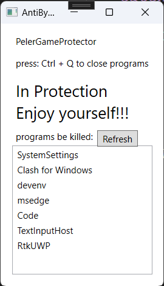

AntiBydProtector
===========

A program that allows you use the short key to close any suftware quickly and effortlessly.

It's very useful when you want to play the computer in the classroom, and as soon as the teacher walk towards you, you can press the short key and close the game.

based on the project <https://github.com/jarvisniu/KeyListener>, a background keyboard listener for .NET/C#, THANKS A LOT:)

## Usage
1. select the process that you want to kill after pressing the Key in the listbox below(you may need to spent sometime finding the process name of the software)
2. if there are some new softwares be opened, just click refresh button
3. press the `Ctrl + Q` to kill the process at any time you want

## F&Q
be free to send emails at peler_little_pig@outlook.com